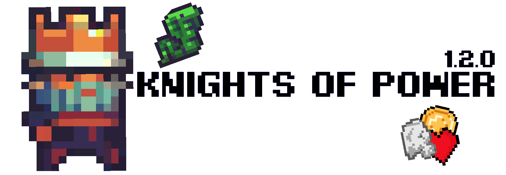

# Knights of Power | ```1.2.0```


[Overview](#overview--big-picture) | [Documentation](#documentation) | [Getting started](#getting-started) | [What we have now ?](#what-we-have-now-) | [Acknowledgements](#acknowledgements) | [Credits](#credits) | [How to contribute ?](#how-to-contribute-) | [GitHub](https://github.com/chepa612/Knights-of-Kingdoms/)

## Overview / Big picture

__Knights of Power__ is a game with a great medieval ambience.  
It was created by Antoine Fontaine.
 
It consist of 5 levels: dry land, underwater...  
  
The NPCs are members of a civilization of elves.  
They are:  
*  Dcopl
*  Zñòdpl
*  Ragnbjörg
*  Milartugîah
*  Bcamoléüs
*  Cbulömtali
*  Léauxbröuœl
*  Æmarjäœ
*  Limaöm
  
The player is a king named ___Ephaem___, the enemies are __snakes__, and there are some __items__:  
* Health potion
* Speed potion
* Potion Delamorkitu
* 5 coins credit
* 10 coins credit

## Documentation
Documentation [__here__](http://176.174.109.28/fr/Knights-of-Power/) (french)

## Getting started

### Prerequisites

The game require __Windows__ with a __64 bits architecture__, nothing else.

### Installation

For installing Knights of Power, you will just have to __unzip the _.zip_ file__ and __open the _``` Knights of Power.exe```_ file__.


###  How to play ?

Action | Key
 :--: | :--: 
Move _Ephaem_ froward | __```→```__ - __```D```__
Move _Ephaem_  to the back | __```←```__ - __```Q```__
Interact with compatible things | __```E```__
Climb to ladders (after pressing ```E```) | __```↑```__ - __```Z```__
Bring _Ephaem_ back down (after pressing ```E```) | __```↓```__ - __```S```__
Jump | __```SPACE```__
Open pause menu | __```ESC```__

## What we have now ?

In Knights of Power ver. ```1.2.0```, we have:

✅ A functional game 🎮  
✅ A great medieval ambience 👑  
✅ 2D and pixelart graphics 👾  
✅ 5 levels 🟢​  
✅ Sounds effects 🔊  
✅ Music 🎶  
✅ NPCs 🗣️​  
✅ Shop ​🛒​  
✅ Free ​💲​  
✅ PlayerPrefs backup 💾​  
✅ Read the signs ​​📜​​  
🔜 Fullscreen / Windowed 💻​  
🔜 10 levels 🔴  
❌ Multiplayer 👥​  
❌ Online 🌐​​  
❌ Beautiful UI ​✨​  
❌ 3D and linear graphics 🚀  

## Acknowledgements

Thanks to __Zef (@TUTOUNITYFR)__ ([YouTube channel](https://www.youtube.com/channel/UCJRwb5W4ZzG43J5_dViL6Fw) | [Website](https://www.tutounity.fr/)) for his help on this project

## Credits

### Graphics

* _A platformer in the forest_ ⇨ By __Butch__
* _Healthbar_ ⇨ By __Brackeys__
* Others graphics & decorations ⇨ By __Zef__

### Audio

* _Hero Immortal_ ⇨ By __Trevor Lentz__
* _Bob's Adventure - Back34_ ⇨ By __Tom Peter__
* _8-bit sound effects library_ ⇨ By __Little Robot Sound Factory__
* _End Credits Theme (Farewell)_ ⇨ By __Cleyton Kauffman__
* _Übermensch [ Main Menu ]_ ⇨ By __Cleyton Kauffman__

### Fonts

* _Pixel Digivolve_ ⇨ By __Pixel Sagas__
* _Xilosa_ ⇨ By __Atila Milanio__
* _Elder Futhark_ ⇨ By __Curtis Clark__

### Website
Click [__here__](http://afflaf.fr/fr/Knights-of-Power/) to view our website

Created by [__HTML5 UP__](https://html5up.net/)

# How to contribute ?

You can share ideas [__here__](https://github.com/chepa612/Knights-of-Kingdoms/discussions/categories/ideas).
